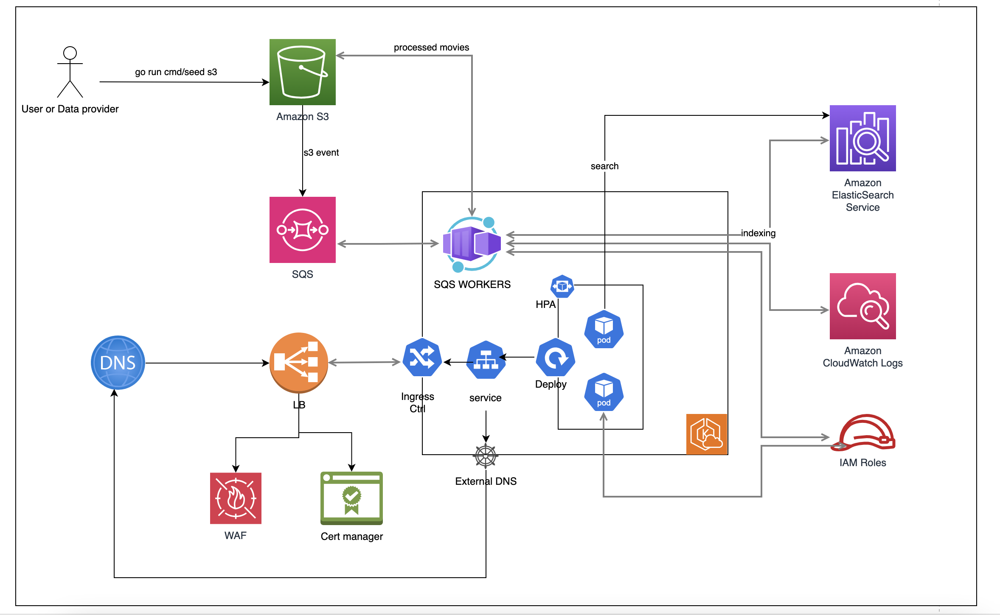

Monitoring 
RateLimiter https://docs.gofiber.io/api/middleware/limiter/


# WIKIMovie 

WIKIMovie acts as a data lake of movies that are injected by providers. It provides a query api that allows searching by name, year, cast member, or  

### Diagram 


Notes: 
- The data store is not specified, noticing heavy reads than writes (which requires indexing and multiple read replicas).  

- Reads are just querying and searching for movies based on different criteria/fields so I was thinking of something like an inverted index (e.g. Apache Solr or ElasticSearch).  inverted index allows fast and efficient search in text fields like cast members, movie name, or genres. it also allows autocomplete, facets (categories with stats), and paging out of the box. 

- While MongoDB can be easier to implement, I don't see any complex queries, transactional or ACID features, Document locking or multi-document transactions but let me know if you would like me to do this with MongoDB specifically.


### Tech stack 
* Docker compose 
* Local stack 
* Kubernetes 
* EKSCtl
* Skaffold.dev
* AWS  
* S3
* SQS 
* Terraform 
* Elastic search 

### Local development

In development environment, run `docker-compose` to be able to run commands on the AWS CLI against localstack.

The `AWS_ENDPOINT` and config `aws.endpoint` is only used for localstack purposes. In live environments, since these variables will be unspecified, the AWS client will automatically use the real AWS URLs.

Note: you may need to add entry in `/etc/hosts` with `localhost.localstack.cloud` pointing to `127.0.0.1` 

Run command like this to list all queues from sqs: 
```
AWS_REGION=us-east-1 aws --endpoint-url=http://localhost.localstack.cloud:4566 sqs list-queues
```

Docker compose will run the following AWS services locally: 
- Elastic search 
- S3 
- SQS

#### Seeds
To load database seeds in development, run from the root directory:
```
go run cmd/seed/main.go s3
```

Note: we can add exxtra option of sqs here to feed with sqs fixtures directly. 


## API

Use the Postman file in the `postman/Wikimovie.postman_collection.json` for all supported API calls.

### Environment Variables

Expected environment values that are expected to be set in the respective environment.

|                        KV                         |
|:-----------------------------------------------------:|
|                    AWS_REGION                         |
|                    AWS_ENDPOINT                       |
|                 ELASTICSEARCH_URLS                    |
|                        ENV                            |
|                  WORKER_QUEUE                       |
|                   BUCKET                               |


Note: secrets can include passwords like the one for elastic search in prod environment. 


### What included
- Search Service (implemented with [Fiber](https://github.com/gofiber/fiber) routes)
- Postman collection to help explore and navigate through API
- SQS Client to send/receive messages 
- SQS worker to poll messages from SQS 
- S3 Client to upload/download files
- K8s Manifest to deploy search service 
- Docker compose stack to run localstack with `sqs,s3,es` services


### Enhancements 
- Caching (especially for queries that include all params) can be added to enhance response time 
- Github actions 
- Swagger support 
- Metrics in prometheous  
- Better logging 
- Auth middleware was added for just demo but the logic in there needs to get replaced and integrated with auth providers like Okta/Firebase
- Request Tracing (maybe Jaeger)
- Chaos Monkey Automation 
- SSL Certs 
- Better unit testing and test coverage reports (Codegov)

